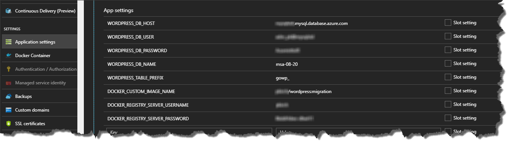
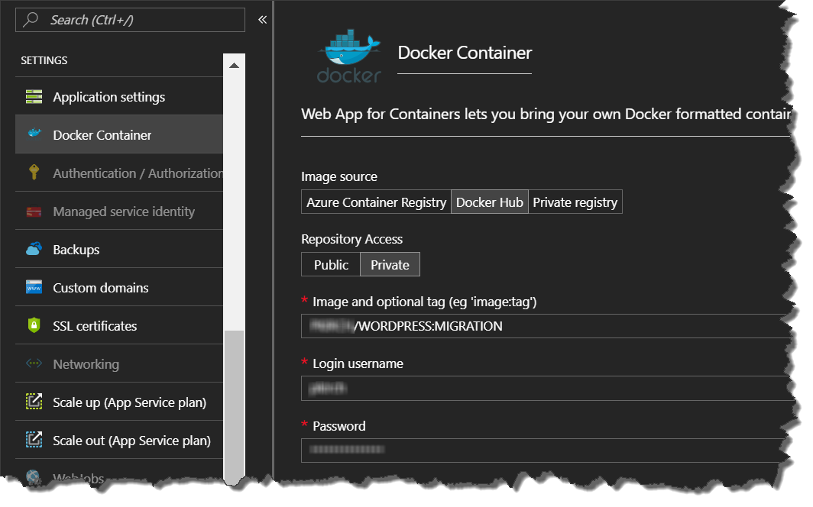
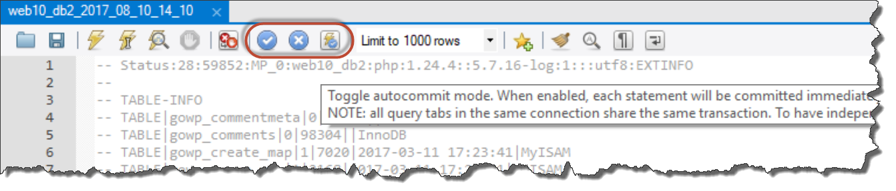

# High-traffic WordPress migration for MySchleppApp (HESA Solutions GmbH)

In order being able to build a web presence which resists a very high load of traffic we have moved an existing WordPress site to Azure Web Apps for Container (aka App Service on Linux) which is based on Docker containers. The back end works on Azure Database for MySQL and in front of the App Service we have a Content Delivery Network (CDN) in place.

As WordPress causes high load on the server we use Web Apps in auto-scale mode to react on higher traffic on the origin in case the CDN is bypassed for several legitimate reasons. Additionally, to have a minimum downtime of the origin (meaning before the CDN) we have at least two instances running.

* Christian Coronel, IT Adminstrator, [HESA Solutions GmbH](https://www.myschleppapp.de/)
* Jan De Coster, Web Master, [c.de IT Solution](http://c-de-solutions.de/)
* Santosh Satschdeva, CEO, [HESA Solutions GmbH](https://www.myschleppapp.de/)
* Mark Pochert, CEO, [Pochert Media UG](https://pochertmedia.com)
* [Peter Kirchner](https://about.me/peterkirchner), Software Engineer, Commercial Software Engineering, Microsoft
 
The joint hackfest took place in Cologne, Germany, August 19th 2017.

## Company profile ##

HESA Solutions GmbH is a startup with an app (iOS/Android) solution to get fast and easy support if you have a car break down. They have parts of their back end in Azure and at a web provider. Their WordPress based web site is completely at a web provider. Despite their young existence they are already partnering with over 693 of the 1800 companies offering car breakdown services in Germany. (https://www.myschleppapp.de/) 
 
## Problem statement ##

In July 2017 HESA approached Microsoft with the request to support a migration of their web presence away from their web provider to Microsoft Azure. Reason was a featuring in the TV show in "Die Höhle der Löwen" (similar to Shark Tank) and there was a reason to believe that their web provider is not able to handle the traffic while the broadcast. The show has usually 4 million viewers. The best case expectation is that 10% are simultaneously browsing to look up the candidates. Each candidate in the show has about 20 minutes airtime, but it is uncertain in what time frame viewers would search for or visit the web site. Thereby our goal was to handle 400,000 concurrent users (CU) on the web site.

## Solution, steps, and delivery ##

We have decided to use Azure App Service's Web Apps for Containers. Because we were building a multi-instance WordPress solution we needed a shared MySQL database which is not deployed on the WordPress' container and used by all container instances.

Further in the progress of the hackfest we found that WordPress was in the given configuration very hungry for performance. We decided early to use the S tier of the App Service plan to be able to autoscale. But with the maximum of 10 instances we would never reach our goal of 400k CU. Our performance measurements showed a maximum of 100 to 200 CU per instance. With 10 instances would that mean a maximum of 2k CU which was far to low.

The bottleneck was CPU. The database's limits were not reached.

### Docker Image ###

The Docker image is almost independent from Azure. There is only one dependency, if you want to use SSH via Kudo. Kudo is an administrative website for Web Apps.

Settings in the Docker image are mainly set by environment variables. Those can be configured via the Web App's applications settings.



Marking a configuration element as slot specific has the effect of establishing that element as not swappable across all the deployment slots associated with the app.

#### Dockerfile ####

We started by creating a dockerfile for our migration.

The first question had been what image to start from to build our Docker image. In the first place we started directly from the WordPress image by Bitnami or Docker. Finally, we decided to start one level lower with an image with PHP and Apache (`php:5.6.31-apache`). _[Why this decision?]_

First thing to do in our image preparation is to configure SSH as described in [Microsoft Docs](https://docs.microsoft.com/en-us/azure/app-service/containers/app-service-linux-ssh-support).

```dockerfile
RUN \
  apt-get update \ 
  && apt-get install -y --no-install-recommends openssh-server \
  && echo "root:Docker!" | chpasswd
```

Next, we configure PHP extensions and set some recommended PHP.ini settings. We took that part from the [WordPress dockerfile](https://github.com/docker-library/wordpress/blob/master/php7.1/apache/Dockerfile).

```dockerfile
RUN set -ex; \
	\
	apt-get update; \
	apt-get install -y \
		libjpeg-dev \
		libpng-dev \
	; \
	rm -rf /var/lib/apt/lists/*; \
	\
	docker-php-ext-configure gd --with-png-dir=/usr --with-jpeg-dir=/usr; \
	docker-php-ext-install gd mysqli opcache

RUN { \
		echo 'opcache.memory_consumption=128'; \
		echo 'opcache.interned_strings_buffer=8'; \
		echo 'opcache.max_accelerated_files=4000'; \
		echo 'opcache.revalidate_freq=2'; \
		echo 'opcache.fast_shutdown=1'; \
		echo 'opcache.enable_cli=1'; \
	} > /usr/local/etc/php/conf.d/opcache-recommended.ini

RUN a2enmod rewrite expires \
	&& a2enmod ssl \
	&& a2enmod headers
```

Next, we copy our customized version of WordPress and our config file for SSH provided by Microsoft Docs. After copying we change the owner to www-data. Additionally, we have a startup file `docker-entrypoint.sh`. Web App for Containers only needs the ports 80 and 2222. HTTPS (443) is provided by the shared frond end. Anyway, it is useful to expose 443 for testing locally.

```dockerfile
# copy files
COPY sshd_config /etc/ssh/
COPY 000-default.conf /etc/apache2/sites-available/
COPY apache2.conf /etc/apache2/

#### WARNING: remove confidential from wp-config.php before pushing to Docker Hub
RUN mkdir /usr/wpsrc
COPY wp/ /usr/wpsrc/

RUN chown -R www-data:www-data /usr/wpsrc

COPY docker-entrypoint.sh /usr/local/bin/

EXPOSE 2222 80 443

ENTRYPOINT ["docker-entrypoint.sh"]
CMD ["apache2-foreground"]
```

##### WordPress source #####

The wpsrc files came from the backup of the WordPress installation from the old hoster's place. We are not able to share this exactly because it contains private data. But if you want to reproduce it on your own just create a WordPress installation somewhere and backup the WordPress' folder's content. If you want to create fast a sample deployment, just follow those steps to do it on your own.

1. Log into your Azure subscription. If you have no one, use a [trial of Azure](https://azure.microsoft.com/en-us/free/).
2. Create a new WordPress installation using a [WordPress template](https://ms.portal.azure.com/#create/bitnami.wordpress4-4).
3. Customize your WordPress deployment. (optional) 
4. Create a backup of the WordPress site.
5. Create a backup of the MySQL database.
6. Copy both backups to your system, where you create the dockerfile.
7. Now, you have what you need to do your own migration.

##### Entrypoint and Cmd #####

A dockerfile has two settings for executing commands at run-time: `Entrypoint` and `Cmd`. You can use both only once but it's possible both together. If you use those settings alone (Entrypoint without Cmd or vice versa), then they are very similar. The difference is that you can override the Cmd setting easily by appending your desired command to `docker run`. To override the Entrypoint setting you have to use the parameter `--entrypoint`.

In our case we use Entrypoint and Cmd together. In this case Entrypoint contains the command to execute and Cmd contains the parameters for the command in the Entrypoint setting. If you don't specify a command in `docker run` then the Cmd setting contains the default parameter.

For reference see docker documentation: [cmd](https://docs.docker.com/engine/reference/builder/#cmd) and [entrypoint](https://docs.docker.com/engine/reference/builder/#entrypoint).

#### docker-entrypoint.sh ####

Mostly we have adopted the `docker-entrypoint.sh` from the WordPress image (https://github.com/docker-library/wordpress/blob/master/docker-entrypoint.sh). We just had to apply some modifications. _[Add links to WordPress entrypoint.sh file and to our own version.]_
* start the SSH service
* instead of downloading WordPress, copy it from the WordPress source folder in the image to the shared directory `/home/site/wwwroot/`.

It is important to leave the section about adding the header `HTTP_X_FORWARDED_PROTO` in the script which is necessary when using a reverse proxy. The shared front end of the Web App is a reverse proxy. Otherwise requests are trapped in an endless redirection loop.

The last line `exec "$@"` is important for the way this docker image is working. This line ensures that you can start any commands with the container without skipping all the important initialization. (Assuming you are not using the `--entrypoint` parameter of the `docker run` command.)

#### Publishing Docker Image ####

After creating all assets for our Docker image we push it to Docker Hub. In our case we used a private repository because in the first migration step we could not be perfectly sure that there would be no confidential data in the image.

```bash
docker push pkirch/wordpress:migration
```

#### Docker Image next version ####

Currently the the Docker image contains a full WordPress installation. We did that only because of time constraints of the hackfest.

This approach increases the image size which increases the duration for creating new Docker containers because it needs to download larger images. In our scenario the most pragmatic solution is just to create a new image with WordPress at all because we have a migration scenario. Once the WordPress installation is present in the shared storage we do not need to copy again the source WordPress installation.

### App Service for Container ###

After publishing the Docker image we create a new Web App for Container (formerly known as App Service On Linux).

The App Service Plan uses the S-tier as it provides auto-scale and up to 10 instances.

As image source we select a private repository on Docker Hub.



It is important to take into consideration that Web Apps for Container mount a shared storage for all instances of the same Web App in the path `/home`. This directory is mounted via CIFS. This is important for our WordPress scenario because WordPress changes files in its own directory, e.g. for plug-ins or configuration. Having the WordPress installation in that shared storage has negative impact on load times which are measurable via tools like the Query Monitor.

Unfortunately, there is no way around to have the WordPress installation on the shared storage because a) we could have more than one instance and b) we need to have a persistent storage for changes in the WordPress directory.

In our case it was important to change the docker image only via the setting Docker Container. Changing it via the application settings lead to unexpected behavior and not loading the correct Docker image. It may be that this has changed in the meantime.

### Data back end ###

As data back end we use an Azure Database for MySQL in standard tier. The restoration of the database from the original database is quite easy. The SQL script needs just some minor changes because the Azure DB for MySQL does not support the MyISAM engine. Those lines have to be changed to InnoDB engine.

For changing the backup script and transferring data to the DB we used MySQL Workbench. (https://dev.mysql.com/downloads/workbench/)

For restore it is important to deactivate autocommit. Otherwise it will take ours instead just minutes. You see that you have disabled autocommit when the buttons for commit and rollback become activated.



### Content Delivery Network (CDN) ###

WordPress uses a lot of compute resources and therefor we would not be able to handle enough concurrent users with even ten instances. This means it is necessary to use a CDN in front of the Web App.

We did measurements with a CDN before the WordPress instance and then it was possible to have much higher load. The use of a CDN has been possible because the WordPress site mainly delivered unchanged, static content. The configuration of the CDN happened after our hackfest and is therefor currently not part of this documentation.

With mainly static content and a CDN in front of WordPress there is not much load on the actual instances. Nevertheless, we kept using S tier to have auto-scale in place of unexpected load on the instance. Especially because there were sideways to access the instance directly without using the CDN.

## Conclusion ##

One of our findings was that it really depends on the configuration of a WordPress installation how much load one instance could handle. High-performance guides recommend to have as few as possible plug-ins installed. As we had to handle a migration from an existing installation, we had not much options to optimize the WordPress installation. The only way to handle the expected amount of concurrent users was to use a CDN in front of the WordPress installation. Fortunately, we were able to use the CDN of the mainly static content. Otherwise this could really would have become an issue.

Going forward the implemented solution using containers ensures a lot of freedom to chose other hosting services. Currently the solution uses Azure App Services' Web Apps for Container. If requirements change in the future it would be possible to move to Azure Container Services, Azure Service Fabric, or even other providers which support container.

Finally, to get an impression of the hackfest and team (without [me](https://github.com/pkirch), because I took the photo).

 and Christian Coronel (on the right)")

## Additional resources ##

Web Apps for Container
https://azure.microsoft.com/en-us/services/app-service/containers/

Azure DB for MySQL
https://azure.microsoft.com/en-us/services/mysql/

CDN
https://azure.microsoft.com/en-us/services/cdn/

Docker
https://docs.docker.com/engine/reference/builder/

GitHub Repository
https://github.com/pkirch/hesawpmigration